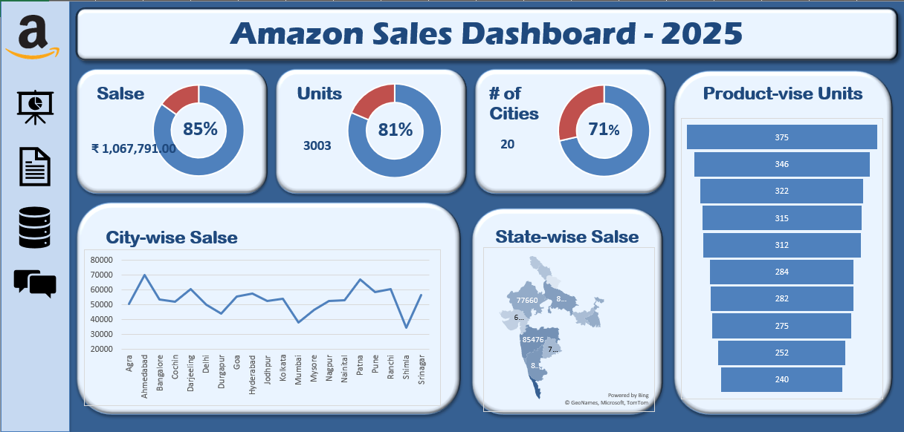

# 📊 Excel Sales Dashboard – India (Amazon-style Sales)

This project is a dynamic and interactive Excel dashboard built to analyze sales performance across different regions and products in India. The dashboard helps visualize KPIs, product trends, and regional performance using a simulated dataset.

---

## 📁 Project Files

- `Excel_Dashboard_Final_Output.xlsx`: Main Excel file containing the dashboard and raw data.
- `dashboard_screenshot.png`: Optional screenshot of the dashboard.
- `salse_dataset.csv`: The dataset used for the project.

---

## 🧾 Dataset Description

This is a **synthetic dataset** generated to simulate **Amazon-style retail sales data** in the Indian market. It contains:
- Product-level transactions
- Units sold
- Total sales (₹)
- Sale locations (States and Cities)
- Sale dates

🔸 The dataset is **not real**, but created for **learning and portfolio purposes** to reflect realistic sales trends and analytics scenarios.

---

## 📊 Dashboard Features

- **KPI Section**: Tracks overall sales, unit targets, city coverage, and performance vs. targets.
- **Product-wise Sales**: Shows which products are performing best.
- **State-wise Sales**: Helps analyze regional performance.
- **City-wise Sales**: Offers deeper location-level insights.

---

## 🛠 Tools Used

- Microsoft Excel
- PivotTables
- Conditional Formatting
- Data Cleaning
- Basic Formulas for KPI tracking

---

## 🎯 Learning Outcome

This project demonstrates:
- Business data storytelling with Excel
- Dashboard building best practices
- Key metric analysis
- Geographic sales performance analysis

---

## 📌 How to Use

1. Download or clone this repository.
2. Open the `Excel_Dashboard_Final_Output.xlsx` file in Excel.
3. Explore the dashboard and understand the logic of KPIs and breakdown tables.

